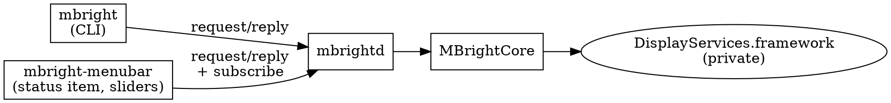

# Architecture

Three binaries, two libraries. Only the daemon touches the displays.



## Processes

**`mbright`** is a client. Every command is a request to the daemon; the
reply carries either the result or the same typed `MBrightError` the
controller would have thrown in-process, so output and exit codes match the
pre-daemon CLI. Without `--daemon-autostart`, a missing daemon is an error
that names both ways to start one.

**`mbrightd`** owns display access. It runs as an `NSApplication` with the
`.prohibited` activation policy: no Dock icon, no UI, but AppKit keeps
`NSScreen.screens` current across hotplugs and the main run loop services
the socket. It never starts or exits on its own: `mbright daemon start`,
the menu bar app, or `--daemon-autostart` start it; `mbright daemon stop`
or SIGTERM stop it, unlinking the socket on the way out. A second copy on
the same socket refuses to start.

**`mbright-menubar`** is a view. It never touches displays. It spawns the
daemon if none is running, subscribes to events, rebuilds its menu on open
and on hotplug, and its sliders follow brightness changes while the menu is
open. It is a bare executable, not an `.app` bundle, because the project
builds with Command Line Tools only; that rules out `SMAppService`, so
Launch at login is a LaunchAgent plist in `~/Library/LaunchAgents`.

## Libraries

| Target | Responsibility |
| --- | --- |
| `MBrightCore` | `BrightnessController`, `DisplaySelector`, `Percent`, display enumeration, the `dlopen` backend, the brightness change observer |
| `MBrightIPC` | Wire messages, JSON-lines codec, Unix socket server and clients, daemon launcher |
| `MBrightMenuBar` | AppKit: status item, slider views, Settings window, LaunchAgent |

Hardware sits behind two protocols, `DisplayEnumerating` and
`BrightnessBackend`. Everything above them is tested against fakes.

## Wire protocol

Newline-delimited JSON over a Unix socket. Both ends are Swift, so the
synthesized `Codable` encoding of these enums is the contract:

```
ClientMessage { id, request }
Request       = readings | get(target) | set(percent, target)
              | adjust(delta, target) | subscribe | version | shutdown
ServerMessage = reply(id, response) | event(event)
Response      = readings([DisplayReading]) | percent | ok | version | failure(MBrightError)
Event         = displaysChanged | brightnessChanged(id, percent)
```

`Target` has a `.id(CGDirectDisplayID)` case for clients that already hold
an ID; the CLI never produces it.

## Notifications

Hotplug: `CGDisplayRegisterReconfigurationCallback`, coalesced over 300 ms
into one `displaysChanged`.

Brightness: `DisplayServicesRegisterForBrightnessChangeNotifications`, a
private symbol resolved optionally. The callback fires for writes from any
process, carrying the display ID and the new value, so the menu bar app
follows the CLI, System Settings, keyboard keys, and a display's own
auto-brightness. Signature confirmed against Lunar and SketchyBar and
verified on the target machine. If the symbol is missing, the app still
refreshes on every menu open.

## Files (XDG Base Directory)

| File | Location |
| --- | --- |
| Socket | `$XDG_RUNTIME_DIR/mbright/mbrightd.sock` |
| Config (planned, #6) | `$XDG_CONFIG_HOME/mbright/` |
| LaunchAgent plist | `~/Library/LaunchAgents/com.axklim.mbright.menubar.plist` (launchd reads nowhere else) |

XDG rules: unset or empty means the default; a relative path is ignored.
There is no other override. macOS never sets `XDG_RUNTIME_DIR`, so the
default is `confstr(_CS_DARWIN_USER_TEMP_DIR)`, the launchd per-user temp
dir, which has the same guarantees (per-user, local, private). The spec's
fallback warning is deliberately not printed, since on macOS the fallback
is the normal path.

launchd does not inherit the shell environment, so enabling Launch at login
writes the `XDG_RUNTIME_DIR` in force into the plist's
`EnvironmentVariables`; otherwise a login-started app and a terminal CLI
would resolve different sockets.

## Private API policy

`DisplayServices` has no public header. Every symbol is `dlsym`ed and
checked: a missing required symbol fails at startup naming it; optional
symbols (smooth set, change notifications) degrade gracefully. Values read
from the framework are validated before use.

## Testing

`./scripts/test.sh`, never bare `swift test`: Swift Testing ships with the
Command Line Tools but is not on SwiftPM's search path, and XCTest is not
available without Xcode. Tests need no hardware: controller and request
handler run against fakes, and the socket tests run a real server loop
in-process on a temporary socket.

Design history: `docs/superpowers/specs/`.
