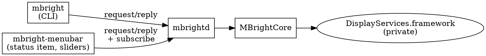

# Architecture

Three binaries, two libraries. Only the daemon touches the displays.



## Processes

**`mbright`** is a client. Every command is a request to the daemon; the
reply carries either the result or the same typed `MBrightError` the
controller would have thrown in-process, so output and exit codes match the
pre-daemon CLI. Without `--daemon-autostart`, a missing daemon is an error
that names both ways to start one.

**`mbrightd`** owns display access. It runs as an `NSApplication` with the
`.prohibited` activation policy: no Dock icon, no UI, but AppKit keeps
`NSScreen.screens` current across hotplugs and the main run loop services
the socket. It never starts or exits on its own: `mbright daemon start`,
the menu bar app, or `--daemon-autostart` start it; `mbright daemon stop`,
Quit in the menu bar app, or SIGTERM stop it, unlinking the socket on the
way out. A second copy on
the same socket refuses to start. Inside the app bundle it lives in
`Contents/Helpers`: an `NSApplication` running from `Contents/MacOS` is,
to LaunchServices, an instance of the app, so a daemon running there while
the app is not (started by the CLI, say) would be what a launch activates
instead of the menu bar app. Clients look for it next to their own executable first, then in
`../Helpers`, then on `PATH`.

It owns the config file: it reads `$XDG_CONFIG_HOME/mbright/config.json`
at start (defaults when missing, a stderr warning when malformed) and is
the only process that writes it. The `login` and `ui` keys drive one
LaunchAgent plist, `com.axklim.mbright`, that starts either the menu bar
app (which starts the daemon, as always) or `mbrightd` alone. The daemon
reconciles the plist with the config on `reloadConfig`, on every
`setConfig`, and at start when a config file loaded; with no config file
the daemon leaves the plist alone at start. It never bootstraps the
plist, and the plist has no `KeepAlive`, so Quit or `daemon
stop` ends a login-started daemon until the next login. A daemon outside
`mbright.app/Contents/Helpers` (a `make run` debug build) skips reconcile
and refuses to enable login, so a scratch daemon never rewrites the real
plist.

**`mbright-menubar`** is a view. It never touches displays. It spawns the
daemon if none is running, subscribes to events, rebuilds its menu on open
and on hotplug, and its sliders follow brightness changes while the menu is
open. It is a bare executable; the `.app` bundle `make install` writes is
only a directory with an `Info.plist` around it, since the project builds
with Command Line Tools only. That rules out `SMAppService`, so Launch at
login is a LaunchAgent plist in `~/Library/LaunchAgents`, written by the
daemon from its config.

## Libraries

| Target | Responsibility |
| --- | --- |
| `MBrightCore` | `BrightnessController`, `DisplaySelector`, `Percent`, display enumeration, the `dlopen` backend, the brightness change observer |
| `MBrightIPC` | Wire messages, JSON-lines codec, Unix socket server and clients, daemon launcher |
| `MBrightDaemon` | Config file, LaunchAgent plist, bundle detection, login reconcile, `SettingsHandler`, `BrightnessSync` |
| `MBrightMenuBar` | AppKit: status item, slider views, Settings window |

Hardware sits behind two protocols, `DisplayEnumerating` and
`BrightnessBackend`. Everything above them is tested against fakes.

## Wire protocol

Newline-delimited JSON over a Unix socket. Both ends are Swift, so the
synthesized `Codable` encoding of these enums is the contract:

```
ClientMessage { id, request }
Request       = readings | get(target) | set(percent, target)
              | adjust(delta, target) | subscribe | version | shutdown
              | config | setConfig(config) | reloadConfig | writeConfig
ServerMessage = reply(id, response) | event(event)
Response      = readings([DisplayReading]) | percent | ok | version | failure(MBrightError)
              | config(ConfigStatus)
Event         = displaysChanged | brightnessChanged(id, percent)
              | configChanged(config)
```

`Target` has a `.id(CGDirectDisplayID)` case for clients that already hold
an ID; the CLI never produces it.

Accepted connections are non-blocking. A client that stops draining its
socket is dropped once a write would block, rather than stranding the main
queue every other client is served on; long-lived clients reconnect on
their next request. Both ends set `SO_NOSIGPIPE`, so a peer that goes away
is an error to handle, not a signal that kills the process.

## Notifications

Hotplug: `CGDisplayRegisterReconfigurationCallback`, coalesced over 300 ms
into one `displaysChanged`.

Brightness: `DisplayServicesRegisterForBrightnessChangeNotifications`, a
private symbol resolved optionally. The callback fires for writes from any
process, carrying the display ID and the new value, so the menu bar app
follows the CLI, System Settings, keyboard keys, and a display's own
auto-brightness. Signature confirmed against Lunar and SketchyBar and
verified on the target machine. If the symbol is missing, the app still
refreshes on every menu open.

The daemon also feeds every brightness notification to `BrightnessSync`
(below), after broadcasting it.

Config: the daemon broadcasts `configChanged` after every successful
`setConfig` or `reloadConfig`, so the menu bar app follows a `mbright
debug on` typed in a terminal.

## Debug log

`debug` in the config turns on an append-only text log per process,
`DebugLog` in `MBrightCore`: `mbrightd.log` for the daemon and
`mbright-menubar.log` for the menu bar app, both under
`$XDG_STATE_HOME/mbright/`. The daemon reads the key at start and on
every config change; the menu bar app asks for the config on every
connect and follows `configChanged`. Off costs nothing: messages are
autoclosures and the file is not opened. A file that cannot be opened
leaves the log off rather than failing the process.

The daemon logs every request with its reply, every CoreGraphics
reconfiguration callback with its flags, the readings it takes when the
burst settles, observer registrations with their return codes, every
brightness notification, and every sync decision including why a
display was skipped. The menu bar app logs connects and disconnects,
events, readings replies, menu rebuilds (views reused or recreated, rows
without a slider), and every set it sends. The log exists because
DisplayServices reports a display that has just reconnected as having
no brightness control for a few seconds, and both processes act 300 ms
after the last callback; the log shows what each side saw at that
moment.

## Brightness sync

`sync` in the config is `off`, `full` (other displays are set to main's
value) or `relative` (other displays move by main's delta and keep their
own level). `BrightnessSync` in `MBrightDaemon` handles `set` and
`adjust` ahead of `RequestHandler` and keeps main's last known percent
in every mode.

A request that writes main alone propagates inside the request; a
propagation failure comes back as the same `partialFailure` that `--all`
produces. A request that writes main together with other displays
(`--all`) only refreshes the last known value: the user addressed every
display. A brightness notification for main whose value differs from the
last known one is a change made by someone else (keyboard keys, System
Settings, auto-brightness) and propagates, with failures logged to
stderr. An equal value is the daemon's own write and is ignored; a
secondary's notification is never acted on. That is the whole loop
guard.

Switching to `full`, starting with it, reloading into it, and a hotplug
under it all set the other displays to main's value at once. Switching
to `relative` or `off` touches nothing. A main display without
brightness control leaves sync idle. Relative clamps at 0 and 100 and
forgets the lost part of a delta.

## Files (XDG Base Directory)

| File | Location |
| --- | --- |
| Socket | `$XDG_RUNTIME_DIR/mbright/mbrightd.sock` |
| Config | `$XDG_CONFIG_HOME/mbright/config.json` (`{"login": false, "ui": true, "sync": "off", "debug": false}` by default; only mbrightd writes it) |
| Debug log | `$XDG_STATE_HOME/mbright/mbrightd.log` and `mbright-menubar.log` (default `~/.local/state`), only when `debug` is on |
| LaunchAgent plist | `~/Library/LaunchAgents/com.axklim.mbright.plist` (launchd reads nowhere else) |
| Install (`make install`) | `~/Applications/mbright.app`: clients in `Contents/MacOS`, `mbrightd` in `Contents/Helpers`; `~/.local/bin/mbright` symlinks into it |

XDG rules: unset or empty means the default; a relative path is ignored.
There is no other override. macOS never sets `XDG_RUNTIME_DIR`, so the
default is `confstr(_CS_DARWIN_USER_TEMP_DIR)`, the launchd per-user temp
dir, which has the same guarantees (per-user, local, private). The spec's
fallback warning is deliberately not printed, since on macOS the fallback
is the normal path.

launchd does not inherit the shell environment, so `enable-login` pins
the `XDG_RUNTIME_DIR`, `XDG_CONFIG_HOME` and `XDG_STATE_HOME` in force
(when set) into the plist's `EnvironmentVariables`. At start and on reload the daemon keeps
whatever the plist already pins, so a daemon started from a terminal with
a scratch runtime dir or config dir does not move the login socket or
config file.

Upgrading from a version whose Settings wrote
`~/Library/LaunchAgents/com.axklim.mbright.menubar.plist`: remove that
file by hand and run `mbright daemon enable-login`. Nothing migrates it.

## Private API policy

`DisplayServices` has no public header. Every symbol is `dlsym`ed and
checked: a missing required symbol fails at startup naming it; optional
symbols (smooth set, change notifications) degrade gracefully. Values read
from the framework are validated before use.

## Testing

`./scripts/test.sh`, never bare `swift test`: Swift Testing ships with the
Command Line Tools but is not on SwiftPM's search path, and XCTest is not
available without Xcode. Tests need no hardware: controller and request
handler run against fakes, and the socket tests run a real server loop
in-process on a temporary socket.

Design history: `docs/superpowers/specs/`.
