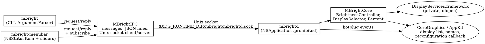
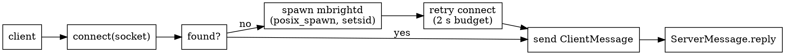

# Menu bar app and daemon — design

Date: 2026-09-06
Issue: https://github.com/axklim/mbright/issues/3

## Goal

Add a menu bar app with one brightness slider per connected display, and
restructure mbright so that both the CLI and the menu bar app are clients
of a single daemon that owns all display access.

## Architecture

Three executables, one library split in two. File locations follow the
XDG Base Directory specification (see "Paths" below).



Only `mbrightd` touches `DisplayServices` or enumerates displays. Clients
never link the backend; they send typed requests and print or render
replies.

### Request flow



Clients look for `mbrightd` next to their own executable, then on `PATH`.
The daemon is spawned detached (its own session, stdio to `/dev/null`) so
it survives the terminal that started it.

### Paths

The issue asks for XDG notation, so every file the tools create goes where
the XDG Base Directory specification says it belongs:

| File | XDG variable | Default on macOS |
| --- | --- | --- |
| `mbright/mbrightd.sock` | `$XDG_RUNTIME_DIR` | `confstr(_CS_DARWIN_USER_TEMP_DIR)`, i.e. `/var/folders/.../T/` |

macOS never sets `XDG_RUNTIME_DIR`. The spec's fallback rule is "a directory
with the same guarantees" (per-user, local, private), which is the launchd
per-user temp dir. The application subdirectory is created `0700`.

XDG rules applied: an unset or empty variable means the default; a relative
path is invalid and ignored. There is no other override: tests and
side-by-side daemons set `XDG_RUNTIME_DIR`, which the clients pass on to
the daemon they spawn.

The spec also says to warn when falling back. On macOS the fallback is the
normal path, taken on every run, so that warning would be constant noise;
it is deliberately not printed.

launchd does not inherit the user's shell environment, so an app started
at login would not see an `XDG_RUNTIME_DIR` exported in `.zshrc` and would
resolve a different socket than the CLI in a terminal: two daemons, and a
slider silently disagreeing with `mbright get`. Enabling Launch at login
therefore writes the runtime dir in force at that moment into the plist's
`EnvironmentVariables`. Changing the variable later means re-enabling the
checkbox. Only a valid runtime dir is written; when none is set, nothing
is, and both ends use the fallback.

Build output is a separate concern owned by the Makefile (PR #4): `make`
builds into `$XDG_CACHE_HOME/mbright/build`, while bare `swift build` and
the Homebrew formula keep `./.build`. Anything the app ever caches goes to
a sibling under `$XDG_CACHE_HOME/mbright/`, never `build`.

Nothing else is written today. When the menu bar app grows real settings,
they go to `$XDG_CONFIG_HOME/mbright/` (default `~/.config/mbright/`). The
LaunchAgent plist is the one exception: launchd only reads
`~/Library/LaunchAgents`, so it cannot follow XDG.

### Daemon lifecycle

- `mbrightd` refuses to start if another instance already answers on the
  socket. A stale socket file (nothing listening) is unlinked and replaced.
- It runs as an `NSApplication` with the `.prohibited` activation policy:
  no Dock icon, no UI, but AppKit keeps `NSScreen.screens` current across
  hotplugs and the main run loop services the socket.
- It never exits on its own. The user starts it on purpose, with
  `mbright daemon start`, by launching the menu bar app (which spawns one
  if needed), or with `--daemon-autostart` on any CLI command. Without the
  flag, a CLI command with no daemon fails with an error naming both ways
  to start one. `mbright daemon stop` sends a `shutdown` request; the
  daemon replies, unlinks its socket, and exits. SIGTERM does the same.
- Two use cases fall out of this: a CLI-only user who wants no background
  process gets one only when they ask for it, and a user who wants a
  daemon runs it deliberately and it stays.

### Brightness change notifications

`DisplayServices` exports `DisplayServicesRegisterForBrightnessChangeNotifications`
(signature confirmed against Lunar and SketchyBar, and verified on the
target machine: the callback fires for writes made by another process,
carrying the display ID and the new value). The daemon registers for every
online display, re-registers after each hotplug, and pushes
`brightnessChanged(id, percent)` to subscribers. That is how the menu bar
app learns about a CLI write, a System Settings change, a keyboard key, or
a display's own auto-brightness. The symbol is resolved with `dlsym` and
optional; when it is missing the app still refreshes on every menu open.

### Wire protocol

Newline-delimited JSON over a Unix domain socket. Types are Swift `Codable`
enums in `MBrightIPC`; both ends are Swift so the synthesized encoding is
the contract.

```
ClientMessage { id: Int, request: Request }
Request       = readings | get(Target) | set(percent, Target)
              | adjust(delta, Target) | subscribe | version | shutdown
ServerMessage = reply(id, Response) | event(Event)
Response      = readings([DisplayReading]) | percent(Int) | ok
              | version(String) | failure(MBrightError)
Event         = displaysChanged | brightnessChanged(id, percent)
```

`Target` gains a `.id(CGDirectDisplayID)` case so the menu bar app can
address a display exactly; the CLI keeps `.main` / `.all` /
`.selector`. `MBrightError` becomes `Codable` so the CLI surfaces the same
typed errors it did before, now produced on the daemon side.

### Display hotplug

The daemon registers `CGDisplayRegisterReconfigurationCallback`. Callbacks
arrive in bursts, so they are coalesced with a 300 ms delay and then one
`displaysChanged` event is broadcast to every connection that sent
`subscribe`. The menu bar app rebuilds its menu on that event.

## Menu bar app

- `NSStatusItem` with the `sun.max` SF Symbol, template rendering.
- Menu rebuilt from `readings` every time it opens and on
  `displaysChanged`; slider positions follow `brightnessChanged` while the
  menu is open, unless that slider is being dragged. Per display: a disabled label item
  ("Studio Display — 79%") and an `NSSlider` in a custom view. Sliders are
  continuous: every value change sends `set(percent, .id(display))`.
  Unsupported displays show "no brightness control" and no slider;
  failed reads show the error text.
- Common items: About mbright… (standard about panel), Settings…, Quit (⌘Q).
- Settings window has one control: "Launch at login". It writes or removes
  `~/Library/LaunchAgents/com.axklim.mbright.menubar.plist` pointing at the
  running executable. `SMAppService` needs an app bundle, and this is a bare
  SwiftPM executable, so a LaunchAgent is the portable option.
- Activation policy `.accessory`: no Dock icon.

## Testing

- `MBrightIPC` message round trips through the JSON line codec.
- `LineBuffer` splits partial and multi-line reads correctly.
- `RequestHandler` against the existing fake enumerator and backend: every
  request maps to the right controller call and every `MBrightError` comes
  back as `.failure`.
- Server/client integration on a temporary socket path in-process:
  request/reply, subscribe + broadcast, and connection teardown.
- `LaunchAgent` plist generation as a pure function.
- Hardware verification is manual: run `mbrightd`, `mbright list`,
  `mbright set`, and the menu bar app against the real displays.

## Out of scope

- Code signing, notarization, or an `.app` bundle.
- Keyboard shortcuts for brightness, smooth fades, presets.
- Any settings beyond Launch at login.
