# Brightness sync with the main display — design

Date: 2026-09-08
Issue: https://github.com/axklim/mbright/issues/8
Follow-up: https://github.com/axklim/mbright/issues/13 (per-display exclude)

## Goal

When the main display's brightness changes, move the other displays too.
Two modes: **full** sets every other display to the main display's value;
**relative** moves every other display by the same delta, so each keeps
its own level. Every display stays adjustable on its own in both modes.
The mode is a config key, switchable from the Settings window and the CLI.

## Decisions

- **Any change to main counts.** Keyboard keys, System Settings, the CLI,
  the menu bar, and the main display's own auto-brightness all propagate.
  The daemon learns about them from the DisplayServices change
  notification it already subscribes to. No polling.
- **Main only triggers.** Changing a secondary display moves nothing else.
  In relative mode that changes its distance from main, and later main
  changes carry the new distance along.
- **Full sync applies at once.** Switching to full, starting the daemon
  with full, and reloading a config that says full all set the other
  displays to main's value immediately. Switching to relative or off
  changes nothing on the displays.
- **Clamping loses the delta.** In relative mode a secondary pinned at 0
  or 100 does not remember the part of a delta it could not apply. The
  displays drift; the user fixes it by hand.
- **No exclude in this cut.** With two displays, excluding the only
  secondary equals sync off. Per-display exclude is #13.
- **No new wire types.** The mode rides in `Config` through the existing
  `setConfig` request. Sync is a daemon behaviour, not a client feature.
- **Propagation happens in the request when the daemon wrote main
  itself, and on the notification when someone else did.** This is what
  keeps `--all` from applying twice and removes the need to track the
  daemon's own writes per display (see Loop prevention).

## Architecture

```dot
digraph sync {
    rankdir=LR;
    node [shape=box];

    cli      [label="mbright sync <mode>\nmbright set | up | down"];
    settings [label="Settings window\nSync radio group"];
    menubar  [label="menu bar sliders"];
    handler  [label="SettingsHandler"];
    sync     [label="BrightnessSync\nmode, lastMain"];
    rh       [label="RequestHandler"];
    ctrl     [label="BrightnessController"];
    ds       [label="DisplayServices", shape=ellipse];
    obs      [label="brightness change\nnotification", shape=ellipse];

    cli      -> handler [label=".setConfig"];
    settings -> handler [label=".setConfig"];
    handler  -> sync    [label="mode changed"];
    cli      -> sync    [label=".set / .adjust"];
    menubar  -> sync    [label=".set / .adjust"];
    sync     -> ctrl    [label="write main,\nthen propagate"];
    sync     -> rh      [label="other requests", style=dashed];
    rh       -> ctrl;
    ctrl     -> ds;
    ds       -> obs     [label="main changed"];
    obs      -> sync    [label="brightnessChanged(id, percent)"];
}
```



### Config

```json
{ "login": false, "ui": true, "sync": "off" }
```

| Key | Default | Meaning |
| --- | --- | --- |
| `sync` | `"off"` | `"off"`, `"full"`, or `"relative"`. |

`SyncMode` is a `String`-backed enum in `MBrightCore/Config.swift`. A
missing key decodes to `off`, so an older file stays valid. An unknown
value is a decode error, reported like any other malformed config.

### BrightnessSync (MBrightDaemon)

Main actor, like `SettingsHandler`. Owns:

- `mode: SyncMode`
- `lastMain: Int?` — main's last known percent; `nil` when there is no
  main display with brightness control, which makes sync idle.
- the `BrightnessController`, for reads and writes.

Entry points:

| Call | When | Effect |
| --- | --- | --- |
| `handle(_ request:) -> Response?` | every request, before `RequestHandler` | Handles `.set` and `.adjust`; `nil` for anything else. |
| `brightnessChanged(id:percent:)` | every change notification | Ignore other displays and a value equal to `lastMain`; otherwise propagate the difference and update `lastMain`. |
| `displaysChanged()` | after the hotplug callback | Re-resolve main, re-read `lastMain`; in full mode, snap. |
| `setMode(_:)` | config set, reload, daemon start | Store; if the new mode is full, snap. |

`lastMain` is kept current in every mode, including off, so switching
modes never needs a fresh read.

**Request path.** `handle` runs the write through the controller exactly
as `RequestHandler` does, so replies and errors are unchanged. Then it
resolves the target. If main was not written, nothing more. If main was
written together with other displays (`--all`), `lastMain` is updated and
nothing propagates: the user addressed every display. If main alone was
written, `lastMain` is updated and the change propagates. A failed
propagation write does not undo main; it is reported in the reply as
`MBrightError.partialFailure`, the same error `--all` produces today, so
the CLI prints it and exits non-zero.

**Notification path.** The daemon's observer callback already receives
every display's changes. The daemon forwards each one to
`brightnessChanged(id:percent:)` after the existing broadcast; the sync
knows main's ID and ignores the rest. A propagation failure here has no
requester and is logged to stderr.

**Propagate.** For every online display other than main that reports
brightness control: full writes `lastMain`; relative reads the display,
adds the delta, clamps, writes. Displays without brightness control are
skipped silently, as `--all` skips them. `adjust` and `set` on a
secondary never reach propagate.

**Snap** is propagate in full mode with the current `lastMain`.

### Loop prevention

Only main's notifications matter; a write the sync made to a secondary
fires a callback the sync never looks at. The one thing to avoid is
acting twice on the daemon's own write to main. The request path sets
`lastMain` to the value it wrote, so the notification that follows
carries an equal value and is ignored. If a write ever produced several
intermediate notifications, the relative deltas telescope to zero and
full mode rewrites the same value; either way the secondaries end where
the request path put them.

A notification with a value different from `lastMain` is, by
definition, a change the daemon did not make, and is propagated.

### Delta arithmetic

All in integer percent, after `Percent.fromDevice` rounding. Relative
delta is `new - lastMain`, main's actual change: `up 10` on a main at
95 moves it to 100 and the others by 5. A burst of external changes (a held keyboard
key) arrives as a chain of notifications; each delta is applied and the
sum equals the total change, so no step is lost or double counted.

### Wiring in `mbrightd`

```
settings.onChange = { sync.setMode($0.sync) }
server handler: shutdown → settings.handle → sync.handle → requestHandler.handle
observer: broadcast brightnessChanged; sync.brightnessChanged(id:percent:)
DisplayWatcher: observeAll(); sync.displaysChanged(); broadcast displaysChanged
start: settings.start(); sync.setMode(settings.config.sync)
```

`SettingsHandler` gains an `onChange: ((Config) -> Void)?` called after a
successful `set` or `reload`. It does not learn about sync.

### Clients

**Settings window.** A "Sync with main display" label above three radio
buttons: Off, Full, Relative. Below it one hint line for the selected
mode. The window keeps the config it last received and sends it back
with only the changed key, so `login` and `ui` survive; the current code
rebuilds `Config` from scratch and must change. As with the login
checkbox, the controls show what the daemon holds and a failed change
snaps back.

**CLI.**

```
mbright sync                      print the mode
mbright sync off|full|relative    set it
```

`config show` and `config reload` print a `sync: relative` line after
`ui:`. `mbright sync` reads the config first and changes only `sync`,
like `disable-login` does for `login`.

**Menu bar.** No change. Propagated writes arrive as
`brightnessChanged` events and the sliders already follow them.

## Error handling

- Main without brightness control: `lastMain` is `nil`, sync is idle,
  requests behave as today.
- Propagation failure in a request: `partialFailure` in the reply, main
  already written.
- Propagation failure on a notification: stderr line naming the display
  and the error.
- Config with an unknown `sync` value: `configInvalid`, same path as any
  malformed file.

## Testing

`BrightnessSync` against the existing `DisplayEnumerating` and
`BrightnessBackend` fakes, no hardware:

- full: `set` on main writes the others to the same value; `adjust` too.
- relative: `adjust` on main moves the others by the delta; a secondary
  at 95 clamps to 100 and stays there on the next drop.
- `set --all` writes each display once and updates `lastMain`.
- `set` on a secondary touches nothing else.
- `brightnessChanged` for main equal to `lastMain` is ignored, and so is
  any secondary's; a different main value propagates and updates
  `lastMain`.
- off: nothing propagates in either path.
- `setMode(.full)` snaps at once; `setMode(.relative)` does not.
- `displaysChanged` with a new main picks up its value.
- main unsupported: `lastMain` is `nil`, no writes.
- a failing secondary backend yields `partialFailure` in the request
  path and a log line in the notification path.

`Config` decoding: missing `sync` is `off`; each value round-trips; an
unknown value fails. `describe` in the CLI includes the sync line.

Hardware check before merging: relative mode with the Studio Display as
main and the LG following, keyboard keys and a menu bar drag, then
`mbright up 10 --all` to confirm the LG moves once.

## Out of scope

- Per-display exclude (#13).
- A configured per-display offset. Relative mode covers the common case
  without one.
- Smooth transitions on the propagated writes.
