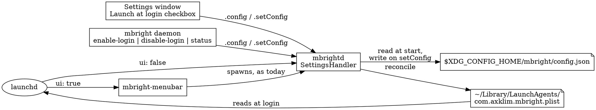

# Config file and daemon startup at login — design

Date: 2026-09-08
Issue: https://github.com/axklim/mbright/issues/6

## Goal

Give mbright a config file under `$XDG_CONFIG_HOME/mbright/`, owned by the
daemon, and make "start at login" a setting in that file. The LaunchAgent
plist becomes a derived artifact the daemon writes from the config, and it
can start either the menu bar app (which starts the daemon, as today) or
`mbrightd` alone.

## Decisions

- **The config is the source of truth.** The plist is derived from it and
  never edited by hand or by the UI.
- **One writer.** Only `mbrightd` reads or writes the config file and the
  plist. The CLI and the Settings window change settings through typed
  requests. No file watching: a hand edit is picked up by
  `mbright config reload` or the next daemon start, and `mbright config
  init` creates a file to edit.
- **One plist, one label** (`com.axklim.mbright`). The `ui` key only
  changes which program it starts.
- **`ui: true` keeps today's direction.** launchd starts the app, the app
  spawns the daemon. The daemon never launches the app. `ui: false` is the
  only new startup path: launchd starts `mbrightd` from `Contents/Helpers`.
- **No `KeepAlive`.** Quit and `mbright daemon stop` end the login-started
  daemon, and launchd does not bring it back until the next login. This
  keeps the "never starts unasked" rule.
- **No migration code.** The old `com.axklim.mbright.menubar` plist is
  removed by hand (one line in the docs). The daemon never looks for it.
- **JSON.** Zero dependencies; the wire format is already Codable.

## Architecture



### Config

```json
{ "login": false, "ui": true }
```

| Key | Default | Meaning |
| --- | --- | --- |
| `login` | `false` | Write a LaunchAgent so mbright starts at login. |
| `ui` | `true` | The LaunchAgent starts the menu bar app. `false`: it starts `mbrightd` only. |

Path: `$XDG_CONFIG_HOME/mbright/config.json`, default
`~/.config/mbright/config.json`. Same XDG rules as the socket: unset or
empty means the default, a relative path is ignored. There is no other
override.

A missing file means defaults. An unreadable or malformed file is reported
on stderr at daemon start, treated as defaults, and left alone until the
next `setConfig` replaces it. The daemon must come up regardless; config
is not its main job.

`Config` is a `Codable`, `Equatable`, `Sendable` struct in `MBrightCore`,
next to the other model types that cross the wire. Unknown keys are
ignored; missing keys take their default, so adding a key later does not
invalidate old files.

### Protocol

Four new `Request` cases and one `Response` case in `MBrightIPC`:

```swift
case config                 // read the daemon's current config
case setConfig(Config)      // persist and apply
case reloadConfig           // re-read the file, reconcile the plist
case writeConfig            // create the file from the current config if absent
...
case config(ConfigStatus)   // reply to all four
```

`ConfigStatus` (in `MBrightCore`) is `config: Config`, `path: String`,
`onDisk: Bool`. Every config request replies with the daemon's state
after the request, so clients render what the daemon holds, never what
they sent.

`RequestHandler` returns `.ok` for all four, the way it does for
`.subscribe` and `.shutdown`; the daemon executable dispatches them to its
own handler before falling through to `RequestHandler`.

Two new `MBrightError` cases, crossing the wire and exiting non-zero like
every other `MBrightError`:

```swift
case loginUnavailable(reason: String)
case configInvalid(path: String, reason: String)
```

Messages: `Launch at login needs mbright installed as an app: <reason>.
Run 'make install' first.` and `Could not read <path>: <reason>`.

### Daemon side: a new `MBrightDaemon` library

Daemon-only logic that needs tests moves out of the `mbrightd` executable
into a library target `MBrightDaemon` (depends on `MBrightCore`,
`MBrightIPC`). The executable keeps `main`, the run loop, signals and the
display watcher. New units:

| Unit | Does | Depends on |
| --- | --- | --- |
| `ConfigFile` | Resolves the XDG path; `load()` returning `Config` or a typed error; `save(_:)` atomic write, creating the directory. | Foundation |
| `LaunchAgent` | Moves here from `MBrightMenuBar`. Label `com.axklim.mbright`. Builds the plist dictionary from a program path and an environment; reads an existing plist back; writes or removes the file. Never bootstraps. | Foundation |
| `InstalledBundle` | From the daemon's own executable path, derives the app bundle root, the app executable path and the daemon path. Returns `nil` unless the daemon runs from `<name>.app/Contents/Helpers/mbrightd`. | Foundation |
| `LoginReconciler` | Pure decision: given `Config`, the `InstalledBundle`, the current environment and the plist currently on disk, returns `.write(plist)`, `.remove`, or `.leave`. | `LaunchAgent` |
| `SettingsHandler` | Holds the in-memory `Config`; handles the four config requests: `setConfig` saves then reconciles; `reloadConfig` loads (a malformed file is `configInvalid` and leaves memory untouched) then reconciles with start-time rules; `writeConfig` saves the held config only when no file exists. | all of the above |

### Reconcile rules

Expected plist: label `com.axklim.mbright`, `RunAtLoad: true`, no
`KeepAlive`, `ProgramArguments` = app executable when `ui` is true or the
daemon when false, `EnvironmentVariables` = the `XDG_RUNTIME_DIR` in force
if one is set (the existing `relevantEnvironment` rule).

| Trigger | `login` | Plist on disk | Action |
| --- | --- | --- | --- |
| any | false | present | remove |
| any | false | absent | leave |
| setConfig | true | any | write, env = current environment |
| start or reload | true | absent | write, env = current environment |
| start or reload | true | present, same program | leave |
| start or reload | true | present, different program | write, env = plist's existing env |

`writeConfig` never touches the plist. On start and reload the environment
already in the plist wins over the daemon's own.
launchd never inherits the shell, so the pinned value is the one that
worked at enable time; a daemon started from a terminal with a scratch
`XDG_RUNTIME_DIR` (the hardware-testing workflow in `CLAUDE.md`) must not
overwrite it. `setConfig` is an explicit user action, so there the current
environment is what the user means.

Guard: when `InstalledBundle` is `nil` (a `make run` debug build, a bare
`swift build`, a copy outside a bundle), start-time reconcile is skipped
and `setConfig` with `login: true` fails with `loginUnavailable` without
touching the file or the plist. `login: false` still saves and removes the
plist, so a user can always turn it off.

### Daemon start

1. Load the config (defaults on missing or malformed, with a stderr line
   for malformed).
2. If running from a bundle, reconcile the plist per the table.
3. Continue as today.

### CLI

```
mbright daemon enable-login [--no-ui]
mbright daemon disable-login
mbright daemon status
mbright config show
mbright config init
mbright config reload
```

`config show` prints the path, whether the file exists, and the values:

```
~/.config/mbright/config.json (not written yet)
login: disabled
ui: menu bar app
```

`config init` sends `writeConfig` so a user has a file to edit. It prints
`wrote <path>` or `<path> already exists`, and never overwrites. `config
reload` sends `reloadConfig`, so a hand edit takes effect without a daemon
restart, and prints the same block as `show`. A malformed file fails with
`configInvalid` and the daemon keeps its previous settings.

`enable-login` sends `setConfig(login: true, ui: !noUI)`; `disable-login`
sends `setConfig(login: false, ui: <current>)` after a `config` request so
it does not reset `ui`. Both print the resulting state:

```
login: enabled, starts the menu bar app
login: enabled, starts mbrightd only
login: disabled
```

`status` prints that line after the running/not-running line. All config
commands respect `--daemon-autostart` as every other command does; without
a daemon they fail with the usual missing-daemon error, since only the
daemon touches the config.

### Menu bar app

`SettingsWindowController` drops its `LaunchAgent` and sends requests
through the existing `DaemonConnection`:

- On show: `config`, then set the checkbox from the reply.
- On toggle: `setConfig(login: checked, ui: true)`; on `.config` set the
  checkbox from the reply; on `.failure` revert the checkbox and show the
  error text in the status label.

The app always sends `ui: true`. A user who wants headless startup uses
the CLI; the window has no second checkbox (out of scope, #7).

Status text becomes "Takes effect at the next login." The pinned
`XDG_RUNTIME_DIR` sentence goes away, since the app no longer knows what
the daemon wrote. `MBrightMenuBar` no longer depends on the plist at all.

### Makefile and docs

- `LAUNCH_AGENT_LABEL` becomes `com.axklim.mbright`. `uninstall` removes
  that plist only.
- `docs/architecture.md`: files table gains the config path and the new
  label; the "Launch at login" paragraph moves ownership to the daemon;
  one-time note: remove `~/Library/LaunchAgents/com.axklim.mbright.menubar.plist`
  by hand and run `mbright daemon enable-login`.
- `docs/cli.md`: the `daemon` and `config` subcommands and their output.
- `README.md`: one line for `enable-login`.
- `CLAUDE.md`: the hardware-testing note gains "a scratch daemon never
  rewrites the login plist; a debug build cannot enable login".

## Testing

All with fakes and temp directories, no hardware, no real
`~/Library/LaunchAgents`:

- `Config`: defaults, Codable round trip, unknown and missing keys.
- `ConfigFile`: XDG path resolution (unset, empty, relative, absolute),
  load missing, load malformed, save then load, save creates directory.
- `LaunchAgent`: plist contents for both programs, with and without
  environment; write, read back, remove.
- `InstalledBundle`: derives paths from a `Helpers/mbrightd` path; `nil`
  for a build-directory path.
- `LoginReconciler`: every row of the reconcile table, plus the
  environment-precedence rule.
- `SettingsHandler`: `config` returns held value; `setConfig` saves and
  reconciles; `login: true` outside a bundle returns `loginUnavailable`
  and writes nothing; `login: false` outside a bundle saves and removes;
  `reloadConfig` picks up a hand edit, rejects a malformed file without
  changing state; `writeConfig` creates once and never overwrites.
- `MBrightIPCTests`: codec round trip for the new cases; `RequestHandler`
  returns `.ok` for them.

## Out of scope

- Headless mode beyond the `ui` key and `--no-ui` (#7).
- Sync with the main display (#8).
- Any migration of the old menubar plist.
- A second Settings checkbox for `ui`.
- Reporting the pinned `XDG_RUNTIME_DIR` back to clients.
