# Keyboard shortcuts — design

Date: 2026-09-12
Issue: https://github.com/axklim/mbright/issues/16

## Goal

Global keyboard shortcuts that adjust brightness, with a default set that
works out of the box and a config key that lets the user change them:

| Keys | Action |
| --- | --- |
| Left Option + F1 / F2 | main display down / up, 5 points |
| Right Option + F1 / F2 | second display down / up, 5 points |
| either, plus Shift | the same, 20 points |

## Decisions

- **The menu bar app listens.** A hotkey is one more way to send `adjust`,
  next to the sliders, so it belongs to the client that already has a
  `DaemonConnection` and a UI to report permission problems. The daemon
  stays without UI or input. Consequence: `login` with `ui: false` starts
  no hotkey listener.
- **CGEventTap, not Carbon `RegisterEventHotKey`.** Carbon hotkeys need no
  permission but cannot tell left Option from right Option, and the issue
  asks for exactly that split. An event tap sees the device-side modifier
  bits and can swallow the event so the system does not also act on it.
  The price is Accessibility access, which the app requests once and
  reports in Settings until granted.
- **Hotkeys live in the config**, the one settings mechanism mbright has:
  a `hotkeys` array in `config.json`, owned by the daemon like every other
  key, edited by hand and applied with `mbright config reload` (or at the
  next daemon start). The menu bar app follows `configChanged`, so a
  reload re-registers the shortcuts without a restart.
- **Bindings are data, not four fixed slots.** Each binding names its
  keys, direction, display and step, so a third display or a different
  step is a config edit, not a code change. The Shift variants are four
  more bindings with a larger step, not a modifier rule: the exact
  modifier match already keeps `lopt+f1` and `lopt+shift+f1` apart.
- **A new `Target.secondary`.** "The second display" is the first online
  display that is not main, whatever its list index. Resolving it in the
  daemon keeps the client stateless and keeps sync's bookkeeping right.
- **No media-key translation.** On Apple keyboards F1 and F2 are
  brightness keys unless "Use F1, F2, etc. keys as standard function keys"
  is on; the default bindings then need Fn held. Translating the media
  keys would double the tap logic for a case this machine cannot verify.

## Architecture

```dot
digraph hotkeys {
    rankdir=LR;
    node [shape=box];

    keyboard [shape=ellipse];
    tap      [label="HotkeyListener\nCGEventTap (session, head insert)"];
    matcher  [label="KeyCombination.matches\n(keycode + modifier flags)"];
    app      [label="StatusMenuController"];
    daemon   [label="mbrightd"];
    config   [label="config.json\nhotkeys: [...]", shape=note];
    settings [label="Settings window\nshortcut list, Accessibility state"];

    keyboard -> tap [label="keyDown"];
    tap -> matcher;
    matcher -> app [label="Hotkey"];
    app -> daemon [label=".adjust(delta, target)"];
    daemon -> config [label="reads; broadcasts\nconfigChanged"];
    daemon -> app [label="configChanged", style=dashed];
    app -> settings;
}
```



### Config

```json
{
  "hotkeys": [
    { "keys": "lopt+f1", "action": "down", "display": "main" },
    { "keys": "lopt+f2", "action": "up",   "display": "main" },
    { "keys": "ropt+f1", "action": "down", "display": "secondary" },
    { "keys": "ropt+f2", "action": "up",   "display": "secondary" },
    { "keys": "lopt+shift+f1", "action": "down", "display": "main", "step": 20 },
    { "keys": "lopt+shift+f2", "action": "up",   "display": "main", "step": 20 },
    { "keys": "ropt+shift+f1", "action": "down", "display": "secondary", "step": 20 },
    { "keys": "ropt+shift+f2", "action": "up",   "display": "secondary", "step": 20 }
  ]
}
```

| Field | Values | Default |
| --- | --- | --- |
| `keys` | modifiers and one key joined by `+` | required |
| `action` | `up`, `down` | required |
| `display` | `main`, `secondary`, `all`, or a `--display` selector | `main` |
| `step` | 1 to 100 | 5 |

A missing `hotkeys` key means the default set above; `[]` turns
shortcuts off. Older files without the key keep working.

`keys` grammar, case-insensitive: modifiers `cmd`, `ctrl`, `opt`, `shift`
(`command`, `control`, `option`, `alt` also accepted), each optionally
prefixed with `l` or `r` for one side only (`lopt`, `ropt`, `rcmd`, ...).
Keys: `f1`–`f20`, `a`–`z`, `0`–`9`, `up`, `down`, `left`, `right`,
`space`, `tab`, `return`, `escape`, `delete`, `forwarddelete`, `home`,
`end`, `pageup`, `pagedown`, and the punctuation keys `-` `=` `[` `]`
`\` `;` `'` `,` `.` `/` `` ` ``. Key codes are the US layout virtual key
codes; a letter names the physical key at that US position. A binding
other than an F-key needs at least one modifier, so a typo cannot
swallow a bare letter system-wide.

A binding that does not parse makes the file invalid: `config reload`
fails naming the binding, and the daemon keeps its previous settings, as
for any other malformed value.

### Matching

A `keyDown` matches a binding when its key code equals the binding's and
the event's Command, Control, Option and Shift set equals the binding's
set exactly. A side-specific modifier additionally requires that side's
device bit (`NX_DEVICELALTKEYMASK` and friends); an unsided modifier
accepts either side. Fn, Caps Lock and the numeric-pad flag are ignored,
so `lopt+f1` also matches Fn + Left Option + F1 on a keyboard whose F1 is
a brightness key by default. Autorepeat events match too, so holding the
key keeps adjusting, the way the built-in brightness keys do. A matched
event is consumed; everything else passes through untouched.

### Menu bar app

`HotkeyListener` (in `MBrightMenuBar`) owns the tap. It is created with
the bindings from the daemon's config, reconfigured on every
`configChanged`, and removed when the list is empty. A tap that the
system disables for a slow callback is re-enabled from the callback. If
the tap cannot be created the app asks for Accessibility access with the
system prompt, once per run, and re-tries every few seconds until it is
granted; the state is readable by the Settings window.

A hit sends `.adjust(delta:target:)`. One adjust is in flight at a time;
deltas that arrive meanwhile are summed per target and sent when the
reply comes back, so a held key tracks the display rather than queueing
behind the daemon. Failures go to the debug log and `lastFailure`, like
a failed slider write.

Settings gets a "Keyboard shortcuts" section listing the current
bindings in the form they are written in the config, a hint that they
are edited there, and, while Accessibility access is missing, a line
saying so with a button that opens the Accessibility pane.

### Daemon and CLI

`Target.secondary` resolves to the first online display that is not
main; with one display it is `noMatch`. `BrightnessSync` needs nothing
new: `.adjust` on a secondary is already a non-main write.

`mbright config show` and `config reload` print one `hotkeys:` line per
binding (`hotkeys: off` for an empty list). No new CLI command: shortcuts
are edited in the file.

### Permission and signing

The build is ad-hoc signed by the linker, so macOS ties the Accessibility
grant to that exact binary: after `make install` of a new build the grant
has to be given again. The Settings window shows when it is missing.

## Testing

`KeyCombination` parsing, canonical form and matching, `Hotkey` and
`Config` coding, and `Target.secondary` resolution run in
`MBrightCoreTests` against fakes. The tap itself needs the window server
and Accessibility, and is verified on hardware by posting synthetic
events from a trusted terminal and reading the LG's brightness back.
